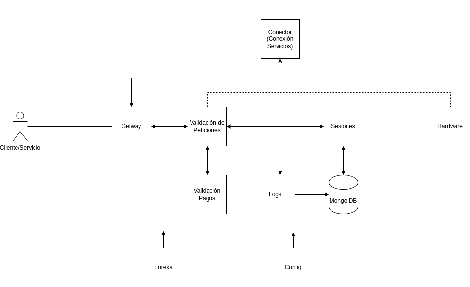

# Servicio de filtrado de peticiones - Broker (SFPB)

## Arquitectura de microservicios

Arquitectura implementada para el servicio **SFPB**

### Micro Servicios

- **Gateway**: La puerta de entrada para los cliente que utilizan o requieren de este servicio
- **Validación**: de Peticiones**: Gestiona y valida si las peticiones con correctas
- **Sesiones**: Gestiona las sesiones necesarios así como las restricciones que conlleva cada una
- **Logs**: Guarda los registro de cada cliente (petición)
- **Conecto**: Es el servicio encargado de redirigir pa peticiones a sus destinos
- **Eureka**: microservicio encargado de que el gateway rendiría sus peticiones a los microservicios internos
- **Config**: Gestiona las configuraciones de los microservicios (todos)
- **Harwat**: Encargado de notificar a la parte física si hay peticiones fraudulentas
