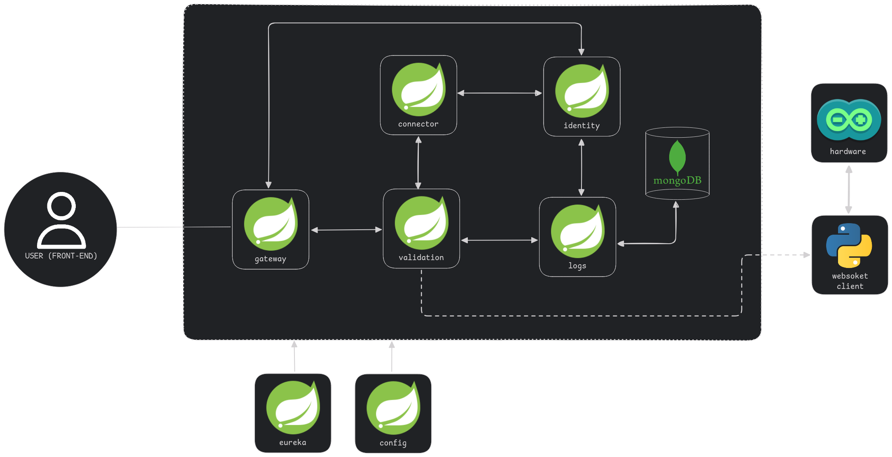

# Servicio de filtrado de peticiones - Broker (SFPB)

> [!NOTE]  
> Tenga en cuenta que este servicio está en desarrollo y puede experimentar 
> errores durante la ejecución.

Este servicio está conectado a un componente de hardware externo (arduino), 
esto para filtrar si las peticiones que está recibiendo son correctas o son 
fraudulentas. Funciona para saber si el equipo o usuario está autorizado para 
realizar una transacción.

## Arquitectura de microservicios

Arquitectura implementada para el servicio **SFPB**

### Micro Servicios

| MicroServicio | Descripción                                                                                                   | PUERTO   |
|---------------|---------------------------------------------------------------------------------------------------------------|----------|
| GATEWAY       | La puerta de entrada para los cliente que utilizán o requieren de este servicio                               | **3761** |
| EUREKA        | Es el servicio encargado de redirigir las peticiones a su destino                                             | 8761     |
| CONFIG        | Microservicio encargado de gestionar las configuración de todos los microservicios utilizadas                 | 8888     |
| CONNECTOR     | Microservicio encargado de redireccioinar las peticiones a los servicios externos                             | 8090     |
| VALIDATION    | Microservicio encargado de las validaciones de las peticiones por parte del cliente (especialmente los pagos) | 9090     |
| IDENTITY      | Microservicio encargado de generar los tokens así como válidar los usuarios con administración                | 8091     |
| EXAMPLE       | Un microservicio _**muestra**_ que ejemplifica; como se conecta con todos los microservicios internos         | 8092     |

## Iniciar Proyecto

Para iniciar el proyecto (realizar pruebas - testeo), primero se tiene que inicializar los
siguientes módulos de la siguiente manera:

> [!WARNING]  
> Si no inicia los microservicios de manera ordenada, no podrá inicializar los servicios **SFPB**, 
> así que tenga cuidado.

1. CONFIG
2. EUREKA
3. GATEWAY
4. MY_SERVICE (Otros servicios)

Ya iniciado los servicios, podemos empezar a utilizar el broker: http://localhost:3761/

## Protocolos

Para comunicarse con el servicio SFPB y redireccionar sus solicitudes mediante HTTP (API REST) ​​a
otros servicios externos, es necesario que sigas los estándares impuestos por el equipo **SFPB**.

[Ir a los Protocolos](./assets/docs/PROTOCOLO.md)
